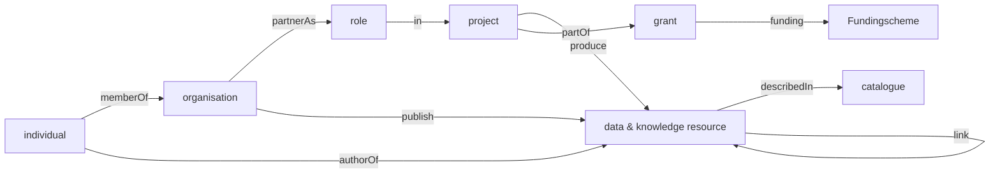

# soilwise-ontology
the soilwise ontology is a model for a knowledge graph including datasets, organisations and catalogues

## DCAT

Datasets (as part of catalogues) is commonly described using the [DCAT ontology](https://www.w3.org/TR/vocab-dcat-2/).

DCAT includes aspects of the dublin core, skos, vcard (to describe an individual) and foaf (to contact a person) ontologies.

## Cordis 

[cordis](https://cordis.europa.eu/) is a catalogue of Horizon Europe funded research projects.

