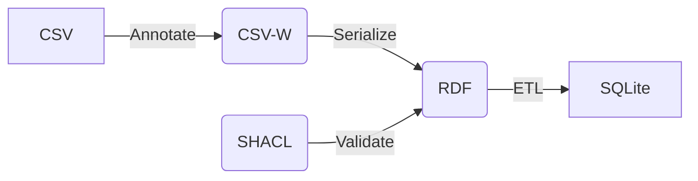

# SoilMission Ontology

The soilmission ontology extends into 3 areas:

- Metadata about data and knowledge resources, people and organisations
- Terminology (glossaries and code lists) for use in the soil domain
- Data models to capture observations, measurements and samples and derived data

## Metadata about data and knowledge resources, people and organisations

Soilwise-he aims to capture on both data and knowledge resources:

- typical metadata, such as title, abstract, author, date
- in which context (project/funding) the resource has been created
- in which catalogue(s) it is described
- any observations (validation, usage, user feedback) on the resource during its lifetime

A repository of practices is being prepared at [docs/metadata](./docs/metadata.md)

## Terminology (glossaries and code lists) for use in the soil domain

At present we're collecting a range of relevant existing vocabularies relevant to the soil domain. The repository is documented at [docs/terminology](./docs/terminology.md)
One of our activities is to try to understand how we can crosswalk between these vocabularies, and any gaps in availability of terms.
Another activity is related to publication of these vocabularies in an easy to use way for soil scientists.

## Data models to capture observations, measurements and samples and derived data 

Various models are in use to capture soil field and laboratory data. Mechanisms are envisioned to capture data in an effective way and share it within the project, in such a way so it easy to use and combine by others, following the FAIR principles. A repository of existing initiatives is being prepared at [docs/soil-observations](./docs/soil-observations.md)

### CSV-W approach

As part of data models, SoilWise aims to provide hands-on guidance based on existing practices. As part of that activity we're exploring a [CSV-W approach](https://csvw.org/) to annotate tabular data, to make it more interoperable. The [data package table-schema](https://datapackage.org/standard/table-schema/) and [iso19110](https://www.iso.org/standard/57303.html) provide a similar approach.

A set of experiments is being developed, which test out various aspects of the CSV-W approach. All experiments use existing tools and conventions, if available.
- A macro enabled [Excel template](./CSVW-Excel-Template/observation-data-with-column-metadata-template.xlsm), which facilitates users to annotate their soil observation dataset
- An approach to serialize [CSV-W](./CSVW-Excel-Template/example3/obs.csv-metadata.json) to various RDF encodings (json-ld, ttl, xml) using the [CSVWLib software](https://github.com/DerwenAI/csvwlib).
- A [SOSA SHACL](https://github.com/KnowWhereGraph/KWG-SHACL/raw/refs/heads/main/shacl_sosa.ttl) validator of the generated RDF
- A [RDF2RDB conversion](./rdf2rdb/soil-rdf2rdb.py), to load SOSA or schema.org RDF into a relational SQLite database

## Related Repos
Matching of various Ontology terms is being done under metadata augmentation, see the [matching table](https://github.com/soilwise-he/metadata-augmentation/blob/main/keyword-matcher/result/terms.csv).

Work has been done under SoilWise on a [Soil Health Knowledge Graph](https://soilwise-he.github.io/soil-health/).

