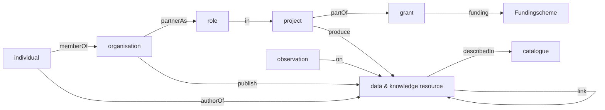

# soilwise-ontology

The soilwise ontology extends into 3 areas:

- Metadata about data and knowledge resources, people and organisations
- Terminology (glossaries and code lists) for use in the soil domain
- Data models to capture observations, measurements and samples and derived data

## Metadata about data and knowledge resources, people and organisations

Soilwise-he aims to capture on both data and knowledge resources:

- typical metadata, such as title, abstract, author, date
- in which context (project/funding) the resource has been created
- in which catalogue(s) it is described
- any observations (validation, usage, user feedback) on the resource during its lifetime

A repository of existing initiatives is being prepared at [docs/metadata](./docs/metadata.md)

### Data model of the metadata knowledge graph

### Dublin Core

### DCAT

Datasets (as part of catalogues) is commonly described using the [DCAT ontology](https://www.w3.org/TR/vocab-dcat-2/).

DCAT includes aspects of the dublin core, skos, vcard (to describe an individual) and foaf (to contact a person) ontologies.

### Cordis / OpenAire 

[cordis](https://cordis.europa.eu/) is a catalogue of Horizon Europe funded research projects.

## Terminology (glossaries and code lists) for use in the soil domain

At present we're collecting a range of relevant existing vocabularies relevant to the soil domain. The repository is documented at [docs/terminology](./docs/terminology.md)
One of our activities is to try to understand how we can crosswalk between these vocabularies, and any gaps in availability of terms.
Another activity is related to publication of these vocabularies in an easy to use way for soil scientists.

## Data models to capture observations, measurements and samples and derived data 

Various models are in use to capture soil field and laboratory data. Mechanisms are envisioned to capture data in an effective way and share it within the project, in such a way so it easy to use and combine by others, following the FAIR principles. A repository of existing initiatives is being prepared at [docs/soil-observations](./docs/soil-observations.md)
