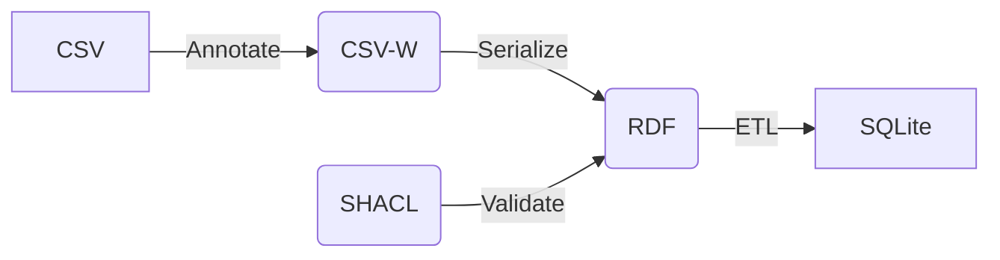

# Approaches to describe metadata at a column level

Different approaches exist to describe column metadata of soil observation data. Some are embedded in existing metadata practices. The column metadata can be used to:

- improve discovery of datasets, by filtering on observed property 
- validate if a CSV is valid
- provide overview statistics of a tabular dataset (min-max-avg)
- ingest data to a common model

A common factor in these approaches is that metadata (which property, which unit of measure, which procedure) is captured in a seperate metadata file which is connected to the data file. Notice that this approach requires that the procedure and unit are constant in the column. Data from different campaigns with different procedures can not be combined in a single file.

Notice that all these initiatives benefit from established vocabularies for soil properties and observation procedures, such as the vocabularies provided by [Australian National SIS](https://vocabs.ardc.edu.au/viewById/634)

## Details

Assumes soil observation data in 1 or 2 related tables

Location

ID | Label | X | Y
--- | --- | --- | ---
uae438 | 10m from street | 2.35 | 50.35 
fte218 | 30m bhind barn | 2.45 | 51.15

Horizon

Profile | Label | Upper | Lower | Date | N | P | K 
--- | --- | --- | --- | --- | --- | --- | --- 
uae438 | O | 0 | 10 | 2025-10-04 | 0.3 | 0.01 | 0.01
uae438 | A | 10 | 30 | 2025-10-04 | 0.1 | 0.01 | 0.01

## Approaches

### Soilwise CSV metadata

This is an approach suggested by SoilWise and not descried elsewhere. Suggestion is to create a second CSV file, {name}-metadata.csv, which contains the column metadata. It is a tailored CSV format, every row on the table describes a column of a dataset. Notice that dataset metadata (title, abstract, ...) is stored in a separate file. This approach is appreciated by scientists because they can use a single tool.

table | column | title | type | property | unit | procedure
--- | --- | --- | --- | --- | --- | ---
obs.csv | N | Nitrogen | numeric | Nitrogen | mole/kg | TotalN_dc
obs.csv | Profile | Profile | loc.csv#ID | | |
loc.csv | ID | Identifier | string | | |
loc.csv | Label | Label | String | | |


### ISO19110 / ISO19115

[ISO19110 Standard on Feature cataloguing](https://www.iso.org/standard/57303.html) is an approach to describe columns in a dataset. Typical properties captured on a feature-attribute are type, uniqueness, etc. This approach is less optimal for capturing observation specific metadata, such as observed property and procedure.

An interesting approach to work with iso19110 metadata is the [MetadataControlFile](https://geopython.github.io/pygeometa/reference/mcf/) format. It is a convention of the geopython community. A subset of [iso19115](https://www.iso.org/standard/53798.html) encoded in YAML. 
Attributes in content info are extended to capture unit and procedure. See [sample](./mcf-sample.yml)

https://github.com/geopython/pygeometa


### OKFN Datapackage

Frictionless data is an initiative of [OKFN](https://okfn.org/en/). Fields from the standard table-schema model could be extended to capture unit and procedure. See [sample](./datapackage-sample.json)

https://specs.frictionlessdata.io/table-schema/
 

### CSV-W 

An initiative of W3C. See [sample](./examples/example3/obs.csv-metadata.json)
Very rich method to annotate CSV's, if properly set up, can generate full SOSA/SSN or Schema.org compatible RDF.

https://csvw.org

In SoilWise we're trying out various aspects of CSV-W:

- A [tool in Excel](./CSVW-Excel-Template/) to annotate an existing sheet
- A [web based tool](https://lsc-hubs.github.io/tabular-soil-data-annotation/), where you can upload your data and annotate it in a web environment
- A [LLM based variation to the annotation tool](https://dataannotator-swr.streamlit.app/) 
- Fix bugs on and extend [CSVWLIB](https://github.com/pvgenuchten/csvwlib/tree/latest) to convert CSV-W to RDF
- A [validator tool](../RDF/shacl_sosa.ttl) to test if the generated RDF is valid for the SOSA ontology
- A tool to convert [RDF to RDB](../RDF/rdf2rdb/) (SQLite)
- [TAPIS](https://www.tapis.grumets.cat), A web tool to visualise and combine sensordata, including CSVW format



### YARRRML

https://rml.io/yarrrml/matey/ is a `friendly` approach to work with rml.io, a modelling technique to model tabular data as RDF.

## Tools

### Annotate from Excel

This [tool in Excel](./CSVW-Excel-Template/) can annotate an existing sheet and export relevant CSV-W metadata
It uses codelists for soil propeties and observation procedures from GLOSIS-LD, which can be updated in a tab.

### A command line tool to work with csvwlib

[csvwlib](https://pypi.org/project/csvwlib/) is a python library to work with csvw concepts. The script `csvw2rdf.py` enables to work with csvwlib from the commandline. I've tested multiple CSVW serializers and I found this one the most complete. We suggested some improvements to the tool  (option to run it from command line). Get the latest version with those suggestons from [our repository](https://github.com/pvgenuchten/csvwlib/tree/latest). 

```
git clone https://github.com/pvgenuchten/csvwlib
cd csvwlib
pip install -e .
csvwlib --meta http://localhost:8080/obs.csv-schema-org-metadata.json --out data.jsonld
```

Else you can install from pip and use the included script.

Install (use a virtual environment):
```bash
pip install -r requirements.txt
python csvw2rdf.py --help
```

Serialize:
```bash
python csvw2rdf.py --meta https://raw.githubusercontent.com/soilwise-he/soilwise-ontology/refs/heads/main/CSVW-Excel-Template/example2/leaves-of-tree-metadata.json --out data.jsonld
```

Or in rdf/xml:
```bash
python csvw2rdf.py --meta https://raw.githubusercontent.com/soilwise-he/soilwise-ontology/refs/heads/main/CSVW-Excel-Template/example2/leaves-of-tree-metadata.json --out data.xml --format xml
```

csvwlib operates on csv and metadata files on the web, you can run a webserver locally to use local files (with node: `npx httpserver`).

## An online tool to annotate tabular soil datasets

[This tool](https://pvgenuchten.github.io/vue-csv-w/) facilitates the annotation of tabular data in a web environment


## Validate SOSA

[pyshacl](https://pypi.org/project/pyshacl/) is a tool to validate a knowledge graph against a set of shacl statements. KWG prepared a [shacl validation for sosa](https://github.com/KnowWhereGraph/KWG-SHACL/blob/main/shacl_sosa.ttl).

```bash
pip install pyshacl
pyshacl -s https://github.com/KnowWhereGraph/KWG-SHACL/raw/refs/heads/main/shacl_sosa.ttl -m -i rdfs -a -j -f human data.ttl
```

