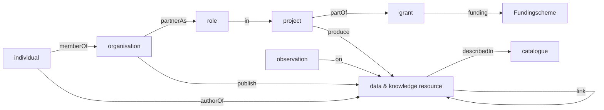

# Metadata practices within the Soil Mission

Metadata is important for discovery and usage of a resource. In this repository we aim to understand which are the relevant metadata properties to focus on. And then understand if these properties can either be ingested or derived from the contents or context of the resource. Or if the community needs to be triggered to endorse capture these properties.


## Data model of the metadata knowledge graph

The Soilwise repository captures metadata from various data silo's. The metadata is harmonised to a common model. The model is described below.




## Suggested EUSO metadata for datasets & knowlede sources

This section describes a metadata profile suggested for EUSO by EJP Soil, extended with a number of properties by ESDAC.

The below profile for metadata is based on EJP Soil and extended with a number of properties suggested by ESDAC. Subject - 'xxx' should be read as: a selected keyword from controlled vocabulary xxx. If xxx is set to EUSO, it means the controlled vocabulary is not yet available and may need to be set up as part of the SWR.


| Label | Cardinality | Codelist | Description |
| ---   | ---         | ---      | ---         |
| Identification | 1-n | | Unique identification of the dataset (A UUID, URN, or URI, such as DOI) |
| Title | 1-1 | | Short meaningful title |
| Abstract | 1-1 | | Short description or abstract (1/2 page), can include (multiple) scientific/technical references |
| Extent (geographic) | 0-1 | BBOX or Geonames | Geographical coverage (e.g. EU, EU & Balkan, France, Wallonia, Berlin) |
| Reference period - Start | 0-1 | | Reference period for the data - Start |
| Reference period - End | 0-1 | | Reference period - End; empty if ongoing |
| Access constraints | 1-1 | INSPIRE | Indicates if the data is publicly accessible or the reason to apply access constaints |
| Usage constraints | 1-1 | INSPIRE | Indicates if there are legal usage constraints (license) |
| Keywords | 0-n |  | Keywords |
| Contact  | 1-n |  | name; organisation; email; role, where role is one of distributor, owner, pointOfContact, processor, publisher, metadata-contact |
| Source   | 0-n |  | Source is a reference to another dataset which is used as a source for this dataset. Reference a single dataset per line; Title; Date; or provide a DOI; |
| isSourceOf | 0-n |  | Other datasets that the current dataset is used as input source |
| Lineage  | 1-1 |  | Statement on the origin and processing of the data |
| Processing steps | 0-n |  | Methods applied in data acquisition and processing: preferably reference a method from a standard (national, LUCAS, FAO, etc.). One processing step per line; Method; Date; Processor; Method reference; Comment |
| Language | 1-n | ISO | Language, of the data and metadata, if metadata is multilingual multiple languages can be provided |
| Reference system | 0-1 | CRS | Spatial Projection: drop down list of options, including ‘unknown’  (you can also leave out the field if it is unknown) |
| Citation | 0-n |  | Citations are references to articles which reference this dataset; one citation on each line; Title; Authors; Date; or provide a DOI |
| Spatial resolution | 0-n |  | Resolution (grid) or scale (vector) |
| Data type | 0-1 | table, vector, grid | The type of data |
| Geometry type | 0-1 | point, line, polygon, ... | Geometry type for vector data |
| File / service Location | 0-n |   | Url or path to the data file or service |
| Format | 0-n | IANA | File Format in which the data is maintained or published |
| Delivery | 0-n |  | The  way the dataset is available (ie digital: download, viewer OR physical way: Shipping or in situ access )  |
| Maintenenance frequency | 0-1 | ISO | Indication of the frequency of data updates |
| Modification date | 0-1 |  | Date of last modification |
| Status | 0-1 | ISO | Status of the dataset |
| Subject - Spatial scope | 0-n | INSPIRE | The scope of the dataset, e.g. regional, national, continental |
| Subject - Soil properties | 0-n | INSPIRE | Soil properties described in this dataset |
| Subject - Soil function | 0-n | INSPIRE  | Soil funtions described in this dataset |
| Subject - Soil threats | 0-n | INSPIRE | Soil threats described in this dataset |
| Subject - Soil Indicators | 0-n | INSPIRE | Soil indicators  described in this dataset |
| Subject - EUSO Data WG subgroup | 0-n | EUSO | The EUSO subgroups which contributed to this record |
| Subject - Context | 0-n | EUSO | Context: (e.g. EU-Project SOILCARE, EJP-Soil, Literature, ESDAC, etc.) |
| Subject - Possible End-users | 0-n | EUSO | Possible end-users: citizens, scientific community, private sector, EU, member states, academia |
| Subject - Category | 0-n | EUSO | One or more thematic categories of the dataset |
| Quality statement | 0-1 | | A statement of quality or any other supplemental information |
| Datamodel/dimensions | 0-1 | | The datamodel (table) or dimensions (grid) of the dataset |
| Units of measure | 0-n | ISU | List of UoM from International System of Units, at attribute/dimension level |
| Attribute type | 0-n | string, number, date | The type of attribute |
| Categorical Data | 0-n |  | Lookup tables for categorical data, at attribute/dimension level |
| Uncertainty | 0-n |  | Method used to assess uncertainty and its result. For example: One or more measurements to describe the error and uncertainties in the dataset |
| Completeness | 0-1 |  | The % of completeness |

## Metadata on data and knowledge items (articles, reports, software, datasets, video, etc)


Then an inventarisation is reported of common ontologies in relevant communities related to metadata on data and knowledge items (articles, datasets, software, etc) and finally a similar effort on metadata on projects, funding, organisations and individuals.

### Dublin Core

Metadata has a long history of standardisation. Various communities have developed metadata models to describe their resources.
[Dublin core](https://www.dublincore.org/specifications/dublin-core/dcmi-terms/) is a common factor in many metadata standards. Dublin core for example is the default profile in [oai-pmh](https://www.openarchives.org/pmh/) and [Catalogue Service for the Web](https://www.ogc.org/standard/cat/).

### Datapackage

[Datapackage](https://datapackage.org/) is used in Open data community (OKFN)

### DCAT/PROV

[DCAT](https://www.w3.org/TR/vocab-dcat-3/) is Used in Semantic web 

### Schema.org

Used by search engines

### Datacite

Used in academia (dataverse, zenodo, datacite)

### ISO19115

Used in Geospatial domain (TC211)

### EML

Used in biodiversity domain (GBIF)

### STAC

Used in earth observation domain (Copernicus)

<hr>

## Metadata on projects, organisations and individuals

###  FOAF 

although FOAF has a [project](http://xmlns.com/foaf/spec/#term_Project) term and a currentproject property, the definitions do not fit cordis, currentproject is only defined on persons, not on organizations.

### PROV

The [`Plan` class](https://www.w3.org/TR/2013/REC-prov-o-20130430/#Plan) in the **PROV-O** ontology can be used for the concept of project. Defined as:

> A plan is an entity that represents a set of actions or steps intended by one or more agents to achieve some goals.

But even the [`Activity` class](https://www.w3.org/TR/2013/REC-prov-o-20130430/#Activity) can be considered:

> An activity is something that occurs over a period of time and acts upon or with entities; it may include consuming, processing, transforming, modifying, relocating, using, or generating entities.


### VCARD

[vcard](https://www.w3.org/TR/vcard-rdf/) does not have project references, but is used extensively on dcat

###  Frapo

the [frapo](http://purl.org/cerif/frapo) is designed to manage organisations which fund or participate in projects, internally frapo uses FOAF to define organizations, frapo suggests [fabio](https://sparontologies.github.io/fabio/current/fabio.html) to be used to describe deliverables (reports, articles, datasets)

### EURIO

the cordis ontology [EURIO](https://op.europa.eu/en/web/eu-vocabularies/dataset/-/resource?uri=http://publications.europa.eu/resource/dataset/eurio) includes all aspects we aim to cover, funding, participation, deliverables, etc. it is based on dingo, euroscivoc and nuts 

###  DOAP

[DOAP ontology](https://github.com/ewilderj/doap) (as described in [article](https://link.springer.com/chapter/10.1007/978-3-540-72667-8_18) is more related to software projects, it has a strong linkage to FOAF

###  DINGO

[dingo](https://dcodings.github.io/DINGO/) describes grants and projects, and organizations which interact with projects through a `role` class (Takes_role). dingo does not define deliverables of a project, dingo:organisations are defined as closematch to foaf:organisations

###  DBPedia

[wikidata](https://www.wikidata.org/wiki/Q170584) includes a project class, it may link to participants through `team` and funders through `stakeholder`

The **DBPedia Ontology** includes both the concepts of [`Project`](https://dbpedia.org/ontology/Project) and [`ResearchProject`](https://dbpedia.org/ontology/ResearchProject), including many useful predicates for to describing funding, participants, coordination, etc.


### Schema.org

[schema.org/Project](https://schema.org/Project) uses `member` to indicate participation of an organization (or person) and `funding` (as `grant`) to indicate funding options

### VIVO

The [**VIVO** ontology](https://vivo.lyrasis.org/wp-content/uploads/2022/10/vivo.owl) is quite elaborate, probably more so than EURIO, including the concept of [`Project`](http://vivoweb.org/ontology/core#Project), and aligning with sub-classes from OBO. Some aspects may be outdated, but worthy or review. 


### Cordis / OpenAire 

[cordis](https://cordis.europa.eu/) is a catalogue of Horizon Europe funded research projects.


##  PROJECT

A couple of years ago Simon Cox developed a light-weight ontology for CSIRO precisely called [**PROJECT**](https://dr-shorthair.github.io/project-ont/docs/). Even though it is not a W3C recommendation, it should be considered, there are fewer people more experimented in this field than Simon. This simple ontology could be the hook for alignment between those I refer above and EURIO.


<hr>

## Use multiple ontologies at once

It is important to keep in mind how the Semantic Web allows you to use all these ontologies together, not having to select one over the other. For instance:

```Turtle
<https://soilwise-he.eu/>
    a proj:ResearchProject,
      dbo:ResearchProject,
      vivo:Project,
      eurio:Project .
```

 
